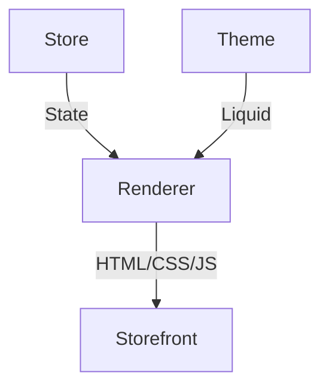
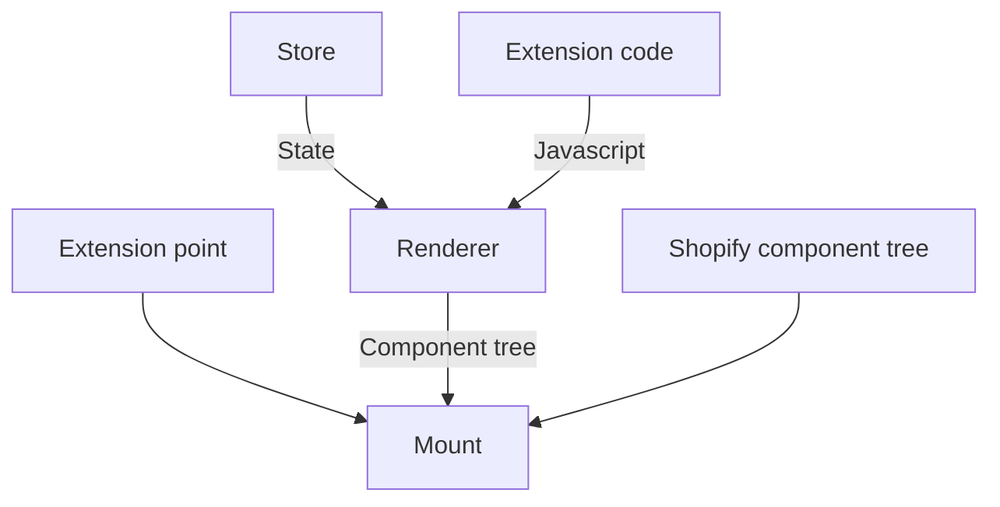

# Building a diverse platform
## Leveraging the developer community and Javascript

<div class="abs-br m-6 flex gap-2">
  <button @click="$slidev.nav.openInEditor()" title="Open in Editor" class="text-xl icon-btn opacity-50 !border-none !hover:text-white">
    <carbon:edit />
  </button>
  <a href="https://github.com/slidevjs/slidev" target="_blank" alt="GitHub"
    class="text-xl icon-btn opacity-50 !border-none !hover:text-white">
    <carbon-logo-github />
  </a>
</div>

---

# Who am I?


- 📝 Developer tools' tinkerer working on [Shopify](https://shopify.com)'s <logos-shopify /> CLI
- 📱 I used to develop iOS apps and tools with Swift <logos-swift />
- 🐣 **Newbie** in the <logos-javascript /> and typescript ecosystems
- 🥘 **Originally from Spain** but I'm trapped in Berlin
- 🌎 **@pepicrft** on the Internet

---
layout: image
image: https://unsplash.com/photos/OAGa7kxfDNY/download?ixid=MnwxMjA3fDB8MXxzZWFyY2h8MXx8YmVybGluJTIwZGFya3xlbnwwfHx8fDE2NTY1MTU1Nzc&force=true
---

# A bit of history

---
layout: image-right
image: 'https://unsplash.com/photos/MGaFENpDCsw/download?ixid=MnwxMjA3fDB8MXxzZWFyY2h8NHx8ZWNvbW1lcmNlfGVufDB8fHx8MTY1NjQ1NjAzNQ&force=true'
---

# Every product starts with a need

Running a business and selling online is hard

You need to:
- Run your own server
- Update the software in it
- Pay for expensive support
- Deal with payment providers
- ...

**Internet can help but...**

---
layout: fact
---

# The 🌍 is diverse
So is the need space and therefore the solutions

---

# 1️⃣ Do we impose a single model onto everyone?
<br/>

## 😔 No, we need to embrace the world's diversity

---

# 2️⃣ Do we build as many versions of the product as shapes of ecommerce?
<br/>

## 😅 That'd be a nightmare engineering and product effort

---

## Wait, there are primitives and business logic that's common everywhere

<br/>

# Product, customer, merchant, order, invoice, inventory, payment, discount...

---
layout: statement
---

# What if we 
# become a 🚀 platform?

---

# You need 3️⃣ things

<br/>

## 1. 🔁 Build Two-way interface to the core domain (HTTP APIs and Webhooks)
## 2. 👩🏾‍💻 Foster developer ecosystem (docs, tools, examples, events)
## 3. 📦 <span class="highlight">Extensibility technologies and surfaces</span>

(And dog-fooding 🐶)

<style>
.highlight {
  color: DeepSkyBlue
}
</style>

---
layout: statement
---

# What can be extended 🧐?

---
layout: statement
---

# Storefront

It's the front side of a store

---
layout: statement
---

### Storefront Extensibility

# Liquid 🎨

Third-party (3P) devs can implement storefronts
<br/>
Liquid templates declare how to present stores' state
<br/>

<br/>

```html


{{ product.title | upcase | remove: 'HEALTH' }}
```

---
layout: center
---



---
layout: statement
---

# Admin

It's the dashboard to manage your store

---
layout: statement
---

### Admin extensibility

# Embedded app 💻

We load an app URL in an `<iframe/>`
<br/>
The app has a session to send authenticated requests to the API
<br/>
UI consistency is achieved through a design system, [Polaris](https://polaris.shopify.com/)

---
layout: center
---


---
layout: image-right
image: '/admin-links.jpg'
---

### Admin extensibility

# Link extensions 🔗

- Apps can declare links that are hooked into the admin UI
- Links deep-link to a page inside the embedded app

---
layout: statement
---

# And <logos-javascript /> and <logos-react /> happened

### Including <logos-react /> Native

---
layout: statement
---

# Admin and mobile apps 
# became <logos-react />

---
layout: statement
---

# We have a common <span class="language">language</span> 
# and <span class="mental-model">mental model</span> to declare
# how state is <span class="presented">presented</span>

<style>
  
.language {
  color: DeepSkyBlue
}
.mental-model {
  color: Gold
}
.presented {
  color: LimeGreen
}
</style>

---
layout: statement
---

# Why not basing our 
# extensibility upon <logos-react/>?



---
layout: statement
---

# <span class="blue">UI Extensions</span>
## Powered by Remote UI
## [github.com/shopify/remote-ui](http://github.com/shopify/remote-ui)

<style>
.blue {
  color: DeepSkyBlue
}
</style>

---
layout: statement
---

# Components are rendered in a <span class="gold">context</span> other than UI thread
## For example, web workers

<style>
.gold {
  color: Gold
}
</style>

---
layout: statement
---

# Remote 🛰
### Provides a way to manage the tree of components

<br/>
<br/>

# Host 🌍
### Maps remote components to UI components

<style>
.gold {
  color: Gold
}
</style>

---
layout: statement
---

# And it works for 📱
# apps too

---
layout: center
---

# Post purchase UI extension
<br/>

```ts {all|1-4|6-7|9-17|all}
import { 
  extend, render, useExtensionInput, 
  BlockStack, Button, Heading, Image 
} from '@shopify/post-purchase-ui-extensions-react';

extend('Checkout::PostPurchase::ShouldRender', async () => { render : true });
render('Checkout::PostPurchase::Render', () => <App />);

export function App() {
  const {done} = useExtensionInput();
  return (
    <BlockStack spacing="loose" alignment="center">
      <Heading>My first post-purchase extension</Heading>
      <Button submit onPress={done}>Click me</Button>
    </BlockStack>
  )
}
```

---
layout: statement
---

<div class="header-primary flex flex-col">
  <div>Checkout UI</div>
  <div>POS UI</div>
  <div>Post-purchase UI</div>
  <div>Web pixel</div>
  <div>Theme app extension (Liquid)</div>
  <div>Discounts (Function)</div>
  <div>Payment customization (Function)</div>
</div>

<style>
.header-primary{
  background-image: linear-gradient(to bottom, #E70000,  #FF8C00,  #FFEF00,  #00811F,  #0044FF,  #760089);
  font-size: 3rem;
  -webkit-background-clip: text;
  color:transparent;
}
</style>

---
layout: center
---


---
layout: center
---


---
layout: center
---


---
layout: statement
---

# Remember <span class="liquid">Liquid</span>?

<br/>

## Developers want to build with modern tooling,
## mental models and have access to a rich ecosystem
## of building blocks

<style>
.liquid {
  color: DeepSkyBlue
}
</style>

---
layout: center
---


# [Hydrogen](https://hydrogen.shopify.dev/)

- <logos-react/>-based opinionated framework 
- SSR with progressive hydration (SEO)
- Hosted by <logos-shopify/> close to the store data (low latency)
- E-Commerce-oriented APIs (e.g. hooks)

---
layout: statement
---

# Developers win
# Users win
# Projects win

---
layout: default
---

# Takeaways

- Adopt the <span class="turquoise">platform</span> mindset.
- Identify what's the platform's <span class="purple">core</span>
- Make it extensible <span class="blue">let developers extend it</span>
- Don't reinvent the wheel, <span class="green">build upon declarative frameworks</span>
- Offer great <span class="gold">tools and docs</span> (e.g. CLI and templates)  
- Build a <span class="pale-green">community</span> and empower it.

## References

- [github.com/shopify/remote-ui](https://github.com/shopify/remote-ui)
- [shopify.dev](https://shopify.dev/)

<style>
.turquoise {
  color: MediumTurquoise
}
.purple {
  color: MediumOrchid
}
.blue {
  color: DeepSkyBlue
}
.gold {
  color: Gold
}
.green {
  color: LimeGreen
}
.pale-green {
  color: PaleGreen
}
</style>

---
layout: center
class: text-center
---

# Danke 🤲

## Questions?
